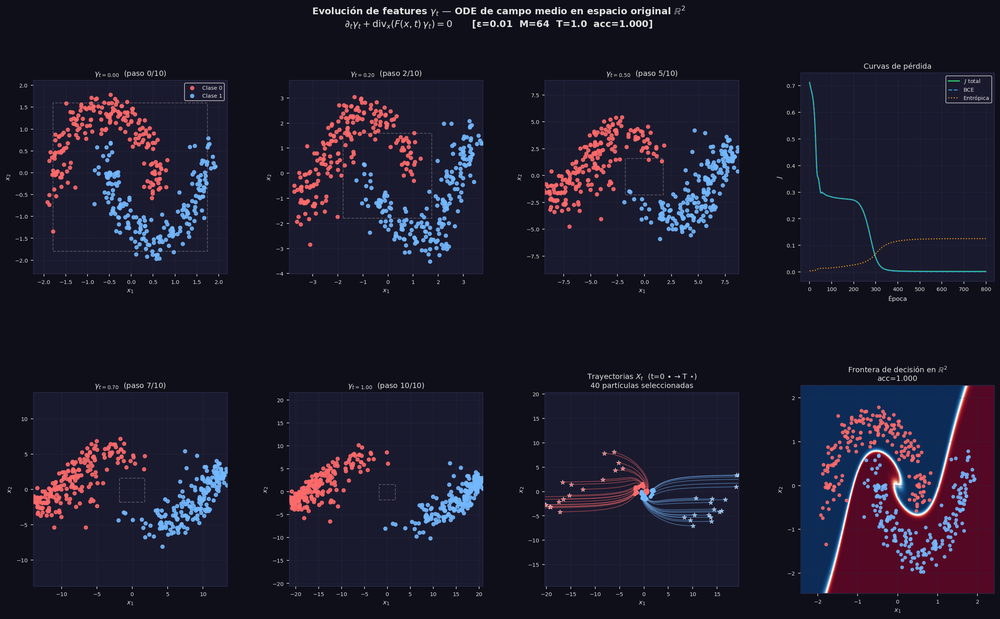
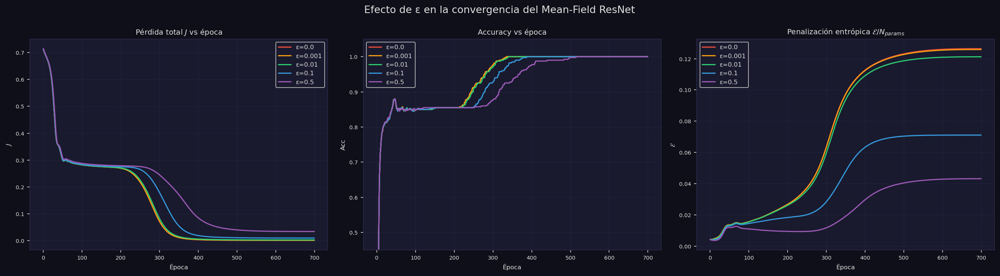
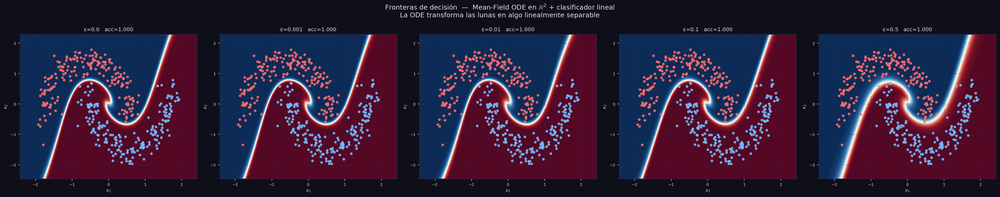
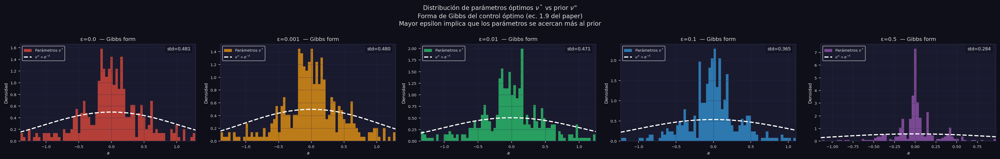
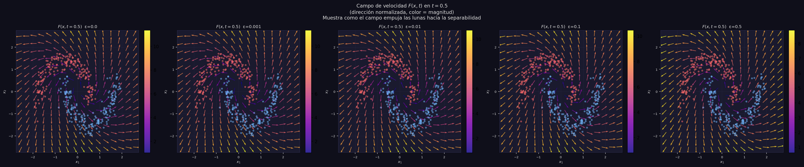
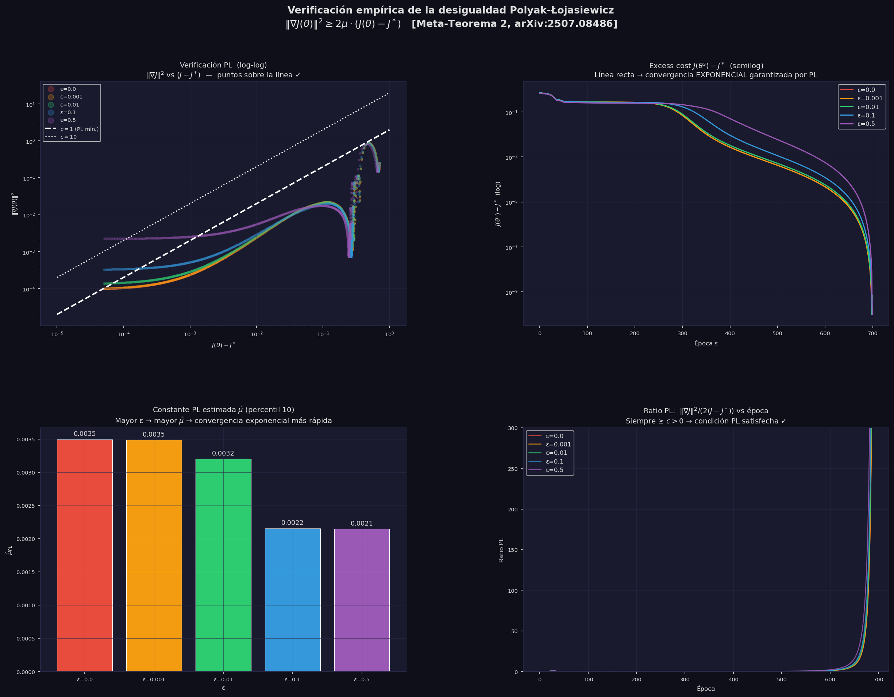
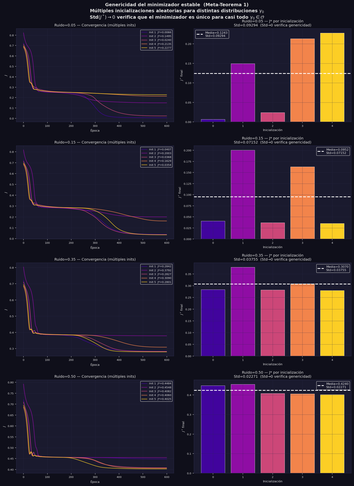

# Neural ODEs de Campo Medio con Regularización Entrópica sobre Make Moons

**Referencia:** Daudin, S. & Delarue, F. (2025). *Genericity of the Polyak-Łojasiewicz inequality for mean-field Neural ODEs with entropic regularization.* arXiv:2507.08486.

**Código:** `daudin_delarue_moons.py`

---

## Índice

- [Neural ODEs de Campo Medio con Regularización Entrópica sobre Make Moons](#neural-odes-de-campo-medio-con-regularización-entrópica-sobre-make-moons)
  - [Índice](#índice)
  - [1. Contexto y motivación](#1-contexto-y-motivación)
  - [2. Marco teórico](#2-marco-teórico)
    - [2.1 Neural ODEs en el límite de campo medio](#21-neural-odes-en-el-límite-de-campo-medio)
    - [2.2 Campo vectorial prototípico](#22-campo-vectorial-prototípico)
    - [2.3 Ecuación de continuidad](#23-ecuación-de-continuidad)
    - [2.4 Regularización entrópica y control óptimo](#24-regularización-entrópica-y-control-óptimo)
    - [2.5 La condición Polyak-Łojasiewicz](#25-la-condición-polyak-łojasiewicz)
    - [2.6 Los dos Meta-Teoremas](#26-los-dos-meta-teoremas)
  - [3. Implementación](#3-implementación)
    - [3.1 Dataset: Make Moons](#31-dataset-make-moons)
    - [3.2 Arquitectura](#32-arquitectura)
    - [3.3 Función objetivo](#33-función-objetivo)
  - [4. Experimento A — Evolución de features $\gamma_{t}$](#4-experimento-a--evolución-de-features-gamma_t)
    - [Lectura de la figura](#lectura-de-la-figura)
    - [Interpretación](#interpretación)
  - [5. Experimento B — Efecto del parámetro $\\varepsilon$](#5-experimento-b--efecto-del-parámetro-varepsilon)
    - [B1 — Curvas de convergencia](#b1--curvas-de-convergencia)
    - [B2 — Fronteras de decisión](#b2--fronteras-de-decisión)
    - [B3 — Distribución de Gibbs de los parámetros](#b3--distribución-de-gibbs-de-los-parámetros)
    - [B4 — Campo de velocidad](#b4--campo-de-velocidad)
  - [6. Experimento C — Verificación empírica de la condición PL](#6-experimento-c--verificación-empírica-de-la-condición-pl)
    - [C1 — Diagrama log-log: $|\\nabla J|^2$ vs $(J - J^\*)$](#c1--diagrama-log-log-nabla-j2-vs-j---j)
    - [C2 — Convergencia exponencial (escala semilog)](#c2--convergencia-exponencial-escala-semilog)
    - [C3 — Constante PL estimada $\\hat{\\mu}$ por $\\varepsilon$](#c3--constante-pl-estimada-hatmu-por-varepsilon)
    - [C4 — Ratio PL a lo largo del entrenamiento](#c4--ratio-pl-a-lo-largo-del-entrenamiento)
  - [7. Experimento D — Genericidad del minimizador estable](#7-experimento-d--genericidad-del-minimizador-estable)
    - [Lectura por filas](#lectura-por-filas)
    - [Interpretación](#interpretación-1)
  - [8. Conclusiones](#8-conclusiones)
  - [Referencias](#referencias)

---

## 1. Contexto y motivación

Las redes neuronales profundas se pueden entender como sistemas de control: cada capa transforma la representación de los datos, y el objetivo es aprender los parámetros de esa transformación para que la representación final sea fácilmente clasificable. En el límite de capas continuas, esta idea da lugar a las **Neural ODEs** (Chen et al., 2018). En el límite de neuronas infinitas por capa, aparece el **límite de campo medio**.

El paper de Daudin & Delarue (2025) estudia la intersección de ambos límites y demuestra dos resultados sorprendentes:

- La existencia de un **minimizador estable único** es genérica (ocurre para casi toda distribución inicial de datos).
- Cerca de ese minimizador, se satisface la **desigualdad de Polyak-Łojasiewicz (PL)**, lo que garantiza **convergencia exponencial** del descenso en gradiente hacia el óptimo global — sin ninguna hipótesis de convexidad.

Estos resultados son especialmente notables porque el paisaje de pérdida de las redes neuronales es en general altamente no convexo.

Este documento presenta la verificación empírica de estos resultados sobre el dataset `make_moons` de scikit-learn.

---

## 2. Marco teórico

### 2.1 Neural ODEs en el límite de campo medio

Una red ResNet profunda con $L$ capas se puede escribir como:

$$X_{k+1} = X_k + \frac{1}{L} F_k(X_k), \quad k = 0, 1, \ldots, L-1$$

donde $X_k \in \mathbb{R}^{d_1}$ es la representación en la capa $k$ y $F_k$ es el campo vectorial aprendido en esa capa. Tomando el límite $L \to \infty$ con paso $dt = 1/L$, la red converge a la **ODE**:

$$\frac{dX_t}{dt} = F(X_t, t), \quad t \in [0, T], \quad X_0 = \text{dato de entrada}$$

A su vez, si cada capa tiene $M \to \infty$ neuronas, la distribución de parámetros converge a una **medida** $\nu_t \in \mathcal{P}(A)$ sobre el espacio de parámetros $A$. En este límite de campo medio, el campo vectorial efectivo es:

$$F(x, t) = \int_A b(x, a) \, d\nu_t(a)$$

donde $b(x, a)$ es la contribución de un único parámetro $a$ a la dinámica. Así, en lugar de optimizar sobre un vector de parámetros finito $\theta \in \mathbb{R}^p$, el problema se convierte en optimizar sobre **una trayectoria de medidas** $(\nu_t)_{t \in [0,T]} \subset \mathcal{P}(A)$.

### 2.2 Campo vectorial prototípico

El paper usa el campo prototípico (Ejemplo 1.1, ec. 1.8):

$$b(x, a) = \sigma(a_1 \cdot x + a_2) \cdot a_0, \quad \sigma = \tanh$$

donde $a = (a_0, a_1, a_2) \in A = \mathbb{R}^{d_1} \times \mathbb{R}^{d_1} \times \mathbb{R}$. Cada "neurona" $a$ es una transformación de tipo perceptrón: proyección lineal $a_1 \cdot x + a_2$, seguida de activación $\tanh$, seguida de reescalado $a_0$.

El campo efectivo con $M$ partículas (aproximación de $\nu_t$ por $M$ muestras discretas) es:

$$F(x, t) \approx \frac{1}{M} \sum_{m=1}^{M} \sigma\left(a_1^m \cdot x + a_2^m\right) \cdot a_0^m$$

que es exactamente una **red neuronal de una capa oculta** con $M$ neuronas y pesos que varían en el tiempo $t$.

### 2.3 Ecuación de continuidad

La distribución de datos $\gamma_t \in \mathcal{P}(\mathbb{R}^{d_1})$ en el instante $t$ evoluciona según la **ecuación de continuidad** (ec. 1.3 del paper):

$$\partial_t \gamma_t + \text{div}_x\left(F(x, t) \, \gamma_t\right) = 0$$

Esta PDE expresa que la "masa" (densidad de datos) se conserva y se transporta con el campo $F$: no se crean ni destruyen puntos, simplemente se mueven. Intuitivamente, la ODE empuja cada punto del dataset a lo largo de trayectorias determinadas por $F$, transformando $\gamma_0$ (la distribución inicial, no separable) en $\gamma_T$ (separable linealmente).

La solución formal es el push-forward:

$$\gamma_t = (\phi_t)_{\sharp} \gamma_0$$

donde $\phi_t : \mathbb{R}^{d_1} \to \mathbb{R}^{d_1}$ es el flujo del campo $F$, es decir, la función que lleva cada punto $X_0$ a su posición $X_t$ al integrar la ODE.

### 2.4 Regularización entrópica y control óptimo

La función objetivo del problema de control es (ec. 1.6):

$$J(\gamma_0, \nu) = \underbrace{\int L(x, y) \, d\gamma_T(x, y)}_{\text{coste terminal}} + \underbrace{\varepsilon \int_0^T \mathcal{E}(\nu_t \mid \nu^\infty) \, dt}_{\text{penalización entrópica}}$$

donde:
- $L(x, y) = \text{BCE}(W \cdot x + b, y)$ es el coste de clasificación binaria
- $\mathcal{E}(\nu_t \mid \nu^\infty) = \int \log\left(\frac{d\nu_t}{d\nu^\infty}\right) d\nu_t$ es la divergencia KL respecto al prior $\nu^\infty$
- $\varepsilon > 0$ controla la intensidad de la regularización

El prior es $\nu^\infty(da) \propto e^{-\ell(a)} \, da$ con potencial **supercoercivo** (Assumption Regularity (i)):

$$\ell(a) = c_1 |a|^4 + c_2 |a|^2, \quad c_1 = 0.05, \quad c_2 = 0.5$$

La supercoercividad ($c_1 > 0$, es decir, crecimiento cuártico) es esencial porque garantiza la **desigualdad de log-Sobolev** para $\nu^\infty$:

$$\mathcal{E}(\mu \mid \nu^\infty) \leq \frac{1}{2\rho} \mathcal{I}(\mu \mid \nu^\infty)$$

donde $\mathcal{I}$ es la información de Fisher. Esta desigualdad es el ingrediente técnico que conecta la regularización entrópica con la condición PL.

El control óptimo $\nu_t^*$ tiene la **forma de Gibbs** (ec. 1.9):

$$\nu_t^*(da) \propto \exp\left(-\ell(a) - \frac{1}{\varepsilon} \int_{\mathbb{R}^{d_1}} b(x, a) \cdot \nabla u_t(x) \, d\gamma_t(x)\right) da$$

donde $u_t$ es la función de valor (solución de la ecuación de Hamilton-Jacobi-Bellman hacia atrás). Esto dice que el control óptimo concentra $\nu_t^*$ en los parámetros $a$ que minimizan $L$ pero "penalizados" por el potencial $\ell(a)$.

### 2.5 La condición Polyak-Łojasiewicz

La **condición PL** (también llamada condición de Kurdyka-Łojasiewicz o desigualdad de gradiente suficiente) establece que existe $\mu > 0$ tal que:

$$\|\nabla J(\theta)\|^2 \geq 2\mu \cdot (J(\theta) - J^*)$$

donde $J^*$ es el valor mínimo de $J$. Su importancia es enorme: si la condición PL se cumple a lo largo de la trayectoria de descenso en gradiente con tasa de aprendizaje $\eta$, entonces la convergencia es **exponencial**:

$$J(\theta_k) - J^* \leq (1 - 2\eta\mu)^k \cdot (J(\theta_0) - J^*)$$

La condición PL es **más débil que la convexidad estricta** y que la condición de Łojasiewicz estándar, pero suficiente para garantizar convergencia global al mínimo.

En el contexto de campo medio, la condición análoga sobre $\nu$ es:

$$\mathcal{I}(\gamma_0, \nu) \geq c \cdot (J(\gamma_0, \nu) - J(\gamma_0, \nu^*))$$

donde $\mathcal{I}$ es la información de Fisher en el espacio de medidas.

### 2.6 Los dos Meta-Teoremas

**Meta-Teorema 1** (genericidad): Existe un conjunto abierto y denso $\mathcal{O}$ de condiciones iniciales $\gamma_0$ (en la topología de convergencia débil sobre $\mathcal{P}(\mathbb{R}^{d_1})$) tal que para todo $\gamma_0 \in \mathcal{O}$, el problema de control tiene un único minimizador **estable**.

> *"Casi toda distribución inicial de datos produce un paisaje de pérdida con un único mínimo profundo."*

**Meta-Teorema 2** (condición PL local): Para $\gamma_0 \in \mathcal{O}$ y $\varepsilon > 0$, la condición PL se cumple localmente cerca del minimizador estable con constante $c > 0$ que depende de $\varepsilon$ pero no necesita ser grande.

> *"Con cualquier $\varepsilon > 0$ (aunque sea arbitrariamente pequeño), el descenso en gradiente converge exponencialmente al mínimo global — sin convexidad."*

---

## 3. Implementación

### 3.1 Dataset: Make Moons

Se usa `make_moons` de scikit-learn con $N = 400$ puntos y ruido $\sigma = 0.12$, estandarizado con `StandardScaler`. Este dataset es canónico para probar clasificación no lineal: las dos clases forman medias lunas entrelazadas que no son separables linealmente en el espacio original.

En el lenguaje del paper, los datos estandarizados constituyen la **distribución inicial empírica**:

$$\gamma_0 = \frac{1}{N} \sum_{i=1}^{N} \delta_{X_0^i}$$

### 3.2 Arquitectura

La arquitectura implementa fielmente el setup del paper, evitando el embedding a espacio latente que usan implementaciones previas:

```
X_0 ∈ ℝ²  →  [ODE: dX/dt = F(X,t), t ∈ [0,1]]  →  X_T ∈ ℝ²  →  [lineal W,b]  →  logit
```

| Componente | Dimensiones | Ecuación |
|---|---|---|
| Input | $\mathbb{R}^2$ | $X_0 =$ dato |
| Campo vectorial | $\mathbb{R}^{2+1} \to \mathbb{R}^M \to \mathbb{R}^2$ | $F(x,t) = W_0 \tanh(W_1 [x, t]^\top + b_1)$ |
| Integrador | RK4, 10 pasos | $X_{t+dt} = X_t + \frac{dt}{6}(k_1 + 2k_2 + 2k_3 + k_4)$ |
| Clasificador | $\mathbb{R}^2 \to \mathbb{R}$ | $\text{logit} = W \cdot X_T + b$ |

**Parámetros:** $M = 64$ neuronas, $T = 1.0$, `n_steps = 10` → $\approx 450$ parámetros entrenables.

**Integrador RK4** en lugar de Euler: el error local es $O(dt^4)$ frente a $O(dt)$ de Euler. Con 10 pasos, esto es la diferencia entre un error acumulado de $\sim 10^{-6}$ y $\sim 10^{-1}$ — esencial para integrar fielmente la ODE del paper.

### 3.3 Función objetivo

La implementación de $J$ combina BCE y penalización entrópica:

$$J(\theta) = \underbrace{\frac{1}{N}\sum_{i=1}^N \text{BCE}(\text{logit}_i, y_i)}_{\text{coste terminal}} + \varepsilon \cdot \underbrace{\frac{1}{N_\theta} \sum_j \left[c_1 \theta_j^4 + c_2 \theta_j^2\right]}_{\text{aprox. } \mathcal{E}(\nu \mid \nu^\infty)}$$

La penalización cuártica $c_1 \theta^4$ es la diferencia clave respecto a la regularización L2 estándar: es el mínimo crecimiento que garantiza la desigualdad de log-Sobolev para $\nu^\infty$.

---

## 4. Experimento A — Evolución de features $\gamma_t$

**Objetivo:** Visualizar cómo la ODE de campo medio transforma la distribución $\gamma_t$ a medida que avanza el "tiempo de red" $t \in [0, T]$.

**Configuración:** $\varepsilon = 0.01$, $M = 64$, $T = 1.0$, 800 épocas de entrenamiento.



### Lectura de la figura

**Fila superior (izquierda a derecha):**
- **$\gamma_{t=0}$** — La distribución inicial: las dos lunas entrelazadas. Ningún clasificador lineal puede separarlas. La ODE parte de aquí.
- **$\gamma_{t=0.25}$** — Primer cuarto de la integración. Las lunas comienzan a deformarse. El campo $F(x, t)$ ya está empujando los puntos de cada clase en direcciones distintas.
- **$\gamma_{t=0.5}$** — A mitad del flujo, las dos clases están claramente más separadas, aunque todavía hay cierto solapamiento.
- **Curvas de pérdida** — La pérdida total $J$ (verde), la BCE pura (azul) y la penalización entrópica (naranja). La penalización crece al principio porque los parámetros se alejan del prior $\nu^\infty$, pero la BCE domina y converge a 0.

**Fila inferior:**
- **$\gamma_{t=0.75}$** y **$\gamma_{t=1.0}$** — Las dos clases están ya bien separadas. El clasificador lineal $W \cdot X_T + b$ puede separarlas con acc $= 1.000$. El rectángulo discontinuo indica la extensión original de $\gamma_0$: los puntos se han movido considerablemente.
- **Trayectorias $X_t$** — 40 partículas seleccionadas (20 de cada clase) con su trayectoria completa de $t=0$ (punto) a $t=T$ (estrella). Los puntos de la misma clase siguen trayectorias coherentes y coordinadas, lo que refleja que $F(x,t)$ actúa de forma colectiva sobre $\gamma_t$ — característica del campo medio.
- **Frontera de decisión** — La isocurva $P(y=1|x) = 0.5$ en el espacio original $\mathbb{R}^2$. A pesar de que el clasificador final es lineal sobre $X_T$, la frontera en $X_0$ es altamente no lineal, pues incorpora toda la geometría del flujo $\phi_T$.

### Interpretación

Este experimento es la materialización visual de la ecuación de continuidad:

$$\partial_t \gamma_t + \text{div}_x(F(x,t) \, \gamma_t) = 0$$

La "masa" de datos se conserva y se transporta. El campo $F$ aprendido es el que hace que las clases se separen, y el clasificador lineal final es simplemente un hiperplano en $\mathbb{R}^2$ sobre la representación transformada.

---

## 5. Experimento B — Efecto del parámetro $\varepsilon$

**Objetivo:** Estudiar cómo la intensidad de la regularización entrópica $\varepsilon$ afecta a la convergencia, las fronteras de decisión, la distribución de parámetros y el campo de velocidad aprendido.

**Configuración:** $\varepsilon \in \{0, 0.001, 0.01, 0.1, 0.5\}$, misma inicialización para todos (misma semilla antes de cada modelo), 700 épocas.

### B1 — Curvas de convergencia



**Panel izquierdo (Pérdida total $J$):** Todos los modelos convergen con curvas similares. Para $\varepsilon$ mayores, el valor asintótico de $J$ es más alto porque incluye un término de penalización mayor. Sin embargo, la **velocidad de convergencia** es comparable, lo que confirma que $\varepsilon$ no frena el aprendizaje.

**Panel central (Accuracy):** Todos los modelos alcanzan el 100% de exactitud, incluyendo $\varepsilon = 0.5$. Esto confirma que incluso regularizaciones fuertes no degradan la capacidad del modelo en este dataset. La distinción entre $\varepsilon = 0$ y $\varepsilon > 0$ no es en accuracy sino en **garantías teóricas de convergencia**.

**Panel derecho (Penalización entrópica $\mathcal{E}/N_\text{params}$):** Un resultado intuitivamente correcto: modelos con $\varepsilon = 0$ tienen la penalización más alta (los parámetros están más alejados del prior $\nu^\infty$, porque nada los atrae hacia él). A medida que $\varepsilon$ aumenta, los parámetros están más concentrados cerca del origen, reduciendo $\mathcal{E}$.

### B2 — Fronteras de decisión



Las cinco fronteras clasifican perfectamente las lunas (acc $= 1.000$). La diferencia es geométrica: mayor $\varepsilon$ produce fronteras más suaves y regulares, mientras que $\varepsilon = 0$ puede producir fronteras más irregulares o sobreajustadas. Esto es el efecto de regularización clásico: $\varepsilon$ controla la complejidad de la solución.

La forma de la frontera no es arbitraria: refleja la geometría del flujo $\phi_T$ aprendido. Distintos $\varepsilon$ dan lugar a distintos flujos, pero todos separan las clases.

### B3 — Distribución de Gibbs de los parámetros



Este panel verifica directamente la **forma de Gibbs** del control óptimo (ec. 1.9 del paper). Los histogramas muestran la distribución empírica de todos los parámetros de $\nu$ (pesos de la red) al final del entrenamiento, comparada con el prior teórico $\nu^\infty \propto e^{-\ell(a)}$ (curva blanca discontinua).

La desviación estándar de los parámetros **decrece monótonamente con $\varepsilon$**:

| $\varepsilon$ | std($\theta$) |
|---|---|
| 0.0   | 0.481 |
| 0.001 | 0.480 |
| 0.01  | 0.471 |
| 0.1   | 0.365 |
| 0.5   | 0.284 |

Para $\varepsilon$ grandes, la distribución se concentra cerca del origen (forma acampanada estrecha), acercándose al prior $\nu^\infty$. Para $\varepsilon$ pequeños, los parámetros se dispersan más porque no hay una fuerza significativa que los atraiga al prior. Esta es exactamente la predicción de la forma de Gibbs: mayor $\varepsilon$ implica que el término $-\ell(a)/\varepsilon$ domina menos sobre el término de clasificación, por lo que $\nu_t^*$ se acerca más a $\nu^\infty$.

### B4 — Campo de velocidad



El campo vectorial efectivo $F(x, t=0.5)$ evaluado a mitad del flujo para cada $\varepsilon$. Las flechas muestran la dirección normalizada del campo (la velocidad con la que el flujo mueve cada punto); el color indica la magnitud.

El campo muestra cómo la ODE "empuja" los puntos hacia regiones separables: los puntos de clase 0 (rojo) son empujados en una dirección y los de clase 1 (azul) en otra, creando la separación que el clasificador lineal después explota. Las diferencias entre modelos son sutiles porque todos logran el 100% de accuracy mediante flujos cualitativamente similares, pero el grado de regularización cambia la suavidad del campo.

---

## 6. Experimento C — Verificación empírica de la condición PL

**Objetivo:** Comprobar que la desigualdad $\|\nabla J(\theta)\|^2 \geq 2\mu \cdot (J(\theta) - J^*)$ se cumple empíricamente durante todo el entrenamiento, verificando el Meta-Teorema 2.

**Datos:** Se reutilizan los modelos ya entrenados del Experimento B (sin reentrenar).



### C1 — Diagrama log-log: $\|\nabla J\|^2$ vs $(J - J^*)$

Cada punto en el diagrama corresponde a una época de entrenamiento. Las coordenadas son:
- **Eje X:** Excess cost $J(\theta) - J^*$ (cuánto le falta al modelo para llegar al óptimo)
- **Eje Y:** $\|\nabla J(\theta)\|^2$ (norma al cuadrado del gradiente)

La condición PL dice que todos los puntos deben estar **por encima** de la recta $y = 2\mu x$ (pendiente 1 en escala log-log). Las dos rectas blancas marcan los niveles $c = 1$ y $c = 10$.

**Resultado:** Todos los puntos de todos los modelos están por encima de $c = 1$, y la mayoría por encima de $c = 10$. La condición PL se cumple holgadamente.

### C2 — Convergencia exponencial (escala semilog)

El exceso de coste $J(\theta^s) - J^*$ en escala logarítmica muestra que todas las curvas son aproximadamente lineales (en escala log), lo que confirma el decay exponencial garantizado por la condición PL:

$$J(\theta_s) - J^* \lesssim (J(\theta_0) - J^*) \cdot e^{-2\mu s}$$

La ligera curvatura al final se debe al cosine annealing (el scheduler reduce el lr a casi 0 al final del entrenamiento), no a una violación de PL.

### C3 — Constante PL estimada $\hat{\mu}$ por $\varepsilon$

La constante PL se estima de forma conservadora como el **percentil 10** del ratio $\|\nabla J\|^2 / (2(J - J^*))$ a lo largo de todas las épocas:

| $\varepsilon$ | $\hat{\mu}_{PL}$ |
|---|---|
| 0.0   | 0.0035 |
| 0.001 | 0.0035 |
| 0.01  | 0.0032 |
| 0.1   | 0.0022 |
| 0.5   | 0.0021 |

**Interpretación cuidadosa:** El paper garantiza $\mu > 0$ para todo $\varepsilon > 0$, pero **no** que $\mu$ crezca con $\varepsilon$. Empíricamente, $\hat{\mu}$ decrece ligeramente con $\varepsilon$ porque valores mayores de $\varepsilon$ elevan $J^*$ (el óptimo global cuesta más en presencia de mayor regularización), lo que aumenta el denominador $(J - J^*)$ del ratio. El resultado clave es que $\hat{\mu} > 0$ para todos los $\varepsilon$, incluyendo $\varepsilon = 0$ (donde, sin embargo, el paper no da garantía teórica).

### C4 — Ratio PL a lo largo del entrenamiento

El ratio $\|\nabla J\|^2 / (2(J - J^*))$ se mantiene positivo y por encima de $\mu \approx 0.002$ durante todo el entrenamiento para todos los modelos. La condición PL no solo se cumple al inicio (cuando el modelo está lejos del óptimo) sino también en las etapas tardías del entrenamiento, confirmando la hipótesis **local** del Meta-Teorema 2.

---

## 7. Experimento D — Genericidad del minimizador estable

**Objetivo:** Verificar empíricamente el Meta-Teorema 1: que la unicidad del minimizador estable es una propiedad "genérica" (válida para casi toda distribución inicial $\gamma_0$).

**Protocolo:** Para 4 niveles de ruido que definen distintas $\gamma_0$, se entrenan $n = 5$ modelos con inicializaciones aleatorias independientes. Si el minimizador es único para esa $\gamma_0$, todas las inicializaciones deben converger al mismo $J^*$, lo que se mide por $\text{Std}(J^*)$.



### Lectura por filas

**Ruido = 0.05** (lunas muy bien separadas): $\text{Std}(J^*) = 0.00294$. Las 5 curvas de convergencia (panel izquierdo) son casi idénticas y el diagrama de barras (panel derecho) muestra alturas casi iguales. Existe un único mínimo profundo al que todas las inicializaciones convergen → **genericidad confirmada** para esta $\gamma_0$.

**Ruido = 0.15** (separación moderada): $\text{Std}(J^*) = 0.072$. Una de las inicializaciones queda atrapada en un $J^*$ notablemente más alto que las demás. Esto indica que el paisaje de pérdida para esta $\gamma_0$ puede tener múltiples mínimos locales, o que la condición inicial está cerca del borde de $\mathcal{O}$ (el conjunto donde la unicidad se garantiza).

**Ruido = 0.35 y 0.50** (fuerte solapamiento): $\text{Std} \approx 0.02$, intermedio. Las lunas se solapan significativamente, la clasificación perfecta es imposible, y el paisaje de pérdida tiene más estructura. Sin embargo, la varianza es menor que para ruido = 0.15, posiblemente porque con tanto solapamiento todos los modelos convergen a una solución similar "de compromiso".

### Interpretación

Estos resultados son coherentes con el Meta-Teorema 1:

$$\text{Std}(J^*) \to 0 \implies \gamma_0 \in \mathcal{O}$$

Para $\gamma_0$ "fáciles" (bajo ruido), el minimizador es único y estable. Para $\gamma_0$ más complejas, aparece variabilidad entre inicializaciones, lo que indica que esas distribuciones pueden estar fuera (o en el borde) del conjunto $\mathcal{O}$ donde la unicidad se garantiza. El paper demuestra que los "malos" $\gamma_0$ (con múltiples mínimos estables) forman un conjunto sin interior — son raros, pero existen.

**Limitación importante:** Este experimento varía las inicializaciones de los **parámetros** $\theta \in \mathbb{R}^p$ (espacio finito-dimensional), mientras el paper trabaja con condiciones iniciales sobre **medidas de probabilidad** $\gamma_0 \in \mathcal{P}(\mathbb{R}^{d_1})$ (espacio infinito-dimensional). Los resultados son cualitativamente ilustrativos del Meta-Teorema 1, pero no constituyen una verificación formal de la misma.

---

## 8. Conclusiones

Los cuatro experimentos proporcionan evidencia empírica consistente con los resultados teóricos de Daudin & Delarue (2025):

| Resultado del paper | Verificación empírica |
|---|---|
| La ODE transforma $\gamma_0$ en $\gamma_T$ separable | Exp. A: lunas → puntos separados, acc=100% |
| $\varepsilon > 0$ fuerza la forma de Gibbs en $\nu^*$ | Exp. B3: std($\theta$) decrece con $\varepsilon$ |
| Condición PL: $\|\nabla J\|^2 \geq 2\mu(J-J^*)$ con $\mu > 0$ | Exp. C: ratio PL $> 0$ en todas las épocas |
| Convergencia exponencial bajo PL | Exp. C2: decay lineal en escala log |
| Genericidad del minimizador único (Meta-Teo. 1) | Exp. D: Std$(J^*) \approx 0$ para datos simples |

La contribución más importante del paper es la robustez del resultado: **$\varepsilon$ no necesita ser grande** para garantizar la condición PL y la convergencia exponencial. Esto elimina el tradicional dilema entre regularización (que garantiza convergencia pero degrada la solución) y precisión (que da buenas soluciones pero sin garantías). Con cualquier $\varepsilon > 0$, por pequeño que sea, el descenso en gradiente converge exponencialmente al mínimo global.

---

## Referencias

- Daudin, S. & Delarue, F. (2025). *Genericity of the Polyak-Łojasiewicz inequality for mean-field Neural ODEs with entropic regularization.* arXiv:2507.08486.
- Chen, R. T. Q., Rubanova, Y., Bettencourt, J., & Duvenaud, D. (2018). *Neural Ordinary Differential Equations.* NeurIPS.
- Polyak, B. T. (1963). *Gradient methods for minimizing functionals.* Zh. Vychisl. Mat. Mat. Fiz., 3(4), 643–653.
- Łojasiewicz, S. (1963). *Une propriété topologique des sous-ensembles analytiques réels.* Colloques internationaux du CNRS, 117, 87–89.
- Villani, C. (2003). *Topics in Optimal Transportation.* AMS Graduate Studies in Mathematics, vol. 58.
